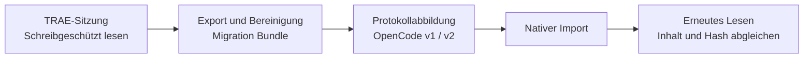

<!-- markdownlint-disable MD013 MD033 MD041 -->

<p align="center">
  <a href="https://trae2opencode.yororoice.top/">
    
  </a>
</p>

<h1 align="center">Trae2OpenCode</h1>

<p align="center">
  <a href="./README.md">简体中文</a>
  ·
  <a href="./README.en.md">English</a>
  ·
  <a href="./README.ja.md">日本語</a>
  ·
  <strong>Deutsch</strong>
  ·
  <a href="./README.ru.md">Русский</a>
  ·
  <a href="./README.zh-Hant.md">繁體中文</a>
</p>

<p align="center">
  <strong>TRAE-Sitzungen vollständig zu OpenCode übertragen.</strong>
  <br>
  Automatisch exportieren, bereinigen, abbilden und importieren und anschließend alle Daten erneut prüfen.
</p>

<p align="center">
  <a href="https://github.com/yororoA/Trae2OpenCode/actions/workflows/quality.yml"></a>
  <a href="https://github.com/yororoA/Trae2OpenCode/releases"></a>
  = 18.18">
  
  <a href="./LICENSE"></a>
</p>

<p align="center">
  <a href="https://trae2opencode.yororoice.top/">Website</a>
  ·
  <a href="#schnellstart">Schnellstart</a>
  ·
  <a href="./docs/operation-manual.md">Bedienungsanleitung</a>
  ·
  <a href="./docs/opencode-compatibility.md">Kompatibilität</a>
  ·
  <a href="./docs/troubleshooting.md">Fehlerbehebung</a>
  ·
  <a href="./CHANGELOG.md">Änderungen</a>
</p>

<!-- markdownlint-enable MD033 MD041 -->

---

> [!IMPORTANT]
> Lesen Sie vor der ersten Migration die [Bedienungsanleitung](docs/operation-manual.md).
> Unter macOS muss TRAE mit den unten gezeigten Debug-Optionen aus einem Terminal gestartet
> werden. Andernfalls kann das Tool die vollständigen Nachrichteninhalte nicht lesen.

## Ein Befehl, überprüfbare Migration

Öffnen Sie das TRAE-Projektfenster mit den gewünschten Sitzungen und führen Sie im
Stammverzeichnis des Repositorys Folgendes aus:

```sh
npm run migrate:local
```

Wählen Sie das Fenster und eine oder mehrere Sitzungen per Nummer aus. Workbench-ID und
Session-ID müssen nie manuell eingegeben werden. Unterbrochene Läufe können anhand ihrer
Migrationsdaten sicher fortgesetzt werden.

| Interaktive Auswahl | Sichere Verarbeitung | Zwei Protokolle | Prüfung nach dem Schreiben |
| :---: | :---: | :---: | :---: |
| Erkennt Projektfenster und Sitzungen | Bereinigt Zugangsdaten und schützt vor Überschreiben | Erkennt OpenCode v1 / v2 automatisch | Gleicht Nachrichten, Reasoning, Tools und Hashes ab |



## Kompatibilität

| Komponente | Anforderung |
| --- | --- |
| TRAE-Quelle | TRAE CN **3.3.104**, angemeldet und mit lokalem CDP-Port `9222` gestartet |
| OpenCode-v2-Ziel | Geprüfte Versionen: **2.0.0** (legacy), **2.0.12**, **2.0.16**; andere stabile 2.x-Versionen werden automatisch geprüft |
| OpenCode-v1-Ziel | Geprüfte Versionen: **1.16.0 / 1.17.0** (legacy), **1.17.9 / 1.18.32**; andere stabile 1.x-Versionen werden automatisch geprüft |
| Betriebssystem | macOS und Windows lesen lokale TRAE-Daten direkt; Linux importiert nur bereits exportierte Bundles |
| Node.js | `>=18.18`; Node.js 22 wird empfohlen |

Anhänge, Skills und MCP-Ressourcen werden derzeit nicht migriert. Unbekannte TRAE-Versionen
werden abgelehnt. Die OpenCode-Kompatibilität wird anhand des tatsächlichen Protokollprofils
und eines isolierten Roundtrip-Tests entschieden, nicht allein anhand der Versionsnummer.

> [!NOTE]
> Bei einer nicht aufgeführten stabilen OpenCode-Version müssen CLI und Zieldienst dieselbe
> Version verwenden. Erforderliche Routen und Schemas müssen exakt übereinstimmen oder dürfen
> nur sichere Ergänzungen enthalten. Import, Export, erneutes Lesen, Konflikte und Löschschutz
> werden vor der Freigabe in einer isolierten temporären Datenbank geprüft.

<!-- Separate adjacent GitHub alerts for Markdown renderers. -->

> [!WARNING]
> Vorabversionen, unbekannte Hauptversionen, inkompatible Schemaänderungen und fehlgeschlagene
> Verhaltenstests werden abgelehnt. `opencode-ai@1.15.x` kann Eigentümer-Metadaten nicht
> erhalten; die OpenAPI von `1.14.x` stellt das vollständige Sitzungsschema nicht bereit.
> Das Tool schreibt niemals direkt in eine ältere Datenbank.

## Schnellstart

### 1. Repository klonen und Abhängigkeiten installieren

Das Paket ist noch nicht auf npm veröffentlicht:

```sh
git clone https://github.com/yororoA/Trae2OpenCode.git
cd Trae2OpenCode
npm ci
```

Prüfen Sie die lokale Umgebung:

```sh
node --version
npm run check
```

### 2. Unterstützte OpenCode-Version installieren

Für OpenCode v2:

```sh
npm install -g @opencode/cli@2.0.16
opencode --version
```

Für OpenCode v1:

```sh
npm install -g opencode-ai@1.18.32
opencode --version
```

Für unterstützte Versionen wird automatisch das aktuelle oder das Legacy-Profil ausgewählt.
Mit `npm run verify:opencode` lässt sich eine lokale Installation vorab prüfen. Der Befehl
unterstützt `--binary`, `--output` und `--json`; Einzelheiten stehen im
[Kompatibilitätsleitfaden](docs/opencode-compatibility.md#独立验证本机-opencode).

`migrate:local` erkennt den aktiven OpenCode-Dienst und dessen dynamischen Port. Ist kein
geeigneter Dienst verfügbar, startet es einen temporären Prozess auf dem lokalen Port `4097`,
verwendet den aktuellen lokalen Sitzungsspeicher und beendet anschließend nur diesen Prozess.

Unter Windows erstellt npm `.cmd`- und `.ps1`-Shims. Das Tool ermittelt die native
`opencode.exe` automatisch. Schlägt dies fehl, verwenden Sie `T2O_OPENCODE_BINARY` oder `--binary`.

### 3. TRAE im Debug-Modus starten

Speichern Sie Ihre Arbeit, beenden Sie TRAE vollständig und starten Sie es unter macOS aus
einem Terminal:

```sh
"/Applications/Trae CN.app/Contents/MacOS/Electron" \
  --remote-debugging-address=127.0.0.1 \
  --remote-debugging-port=9222
```

Verwenden Sie nicht `open -a ... --args`; aktuelle TRAE-Versionen können diese Optionen ignorieren.

Unter Windows PowerShell:

```powershell
& "$env:LOCALAPPDATA\Programs\Trae CN\Trae CN.exe" `
  --remote-debugging-address=127.0.0.1 `
  --remote-debugging-port=9222
```

Passen Sie den Pfad an, falls TRAE an einem anderen Ort installiert ist. Melden Sie sich an,
öffnen Sie das Zielprojekt und prüfen Sie, ob die Sitzungen im Verlauf angezeigt werden.

### 4. Migration starten

```sh
npm run migrate:local
```

Die Überschreibstrategie kann vorab festgelegt werden:

```sh
npm run migrate:local -y  # OVERWRITE automatisch bestätigen
npm run migrate:local -n  # Sitzungen überspringen, die OVERWRITE erfordern
```

Diese Optionen steuern nur die Ersetzung. Workbenches und Sitzungen werden weiterhin aus
einer interaktiven Liste ausgewählt. Ohne Option fordert das Programm zur Eingabe von
`OVERWRITE` auf.

Für jede ausgewählte Sitzung:

1. Erstellt das Tool ein eigenes Bundle und Manifest.
2. Entfernt es erkannte Zugangsdaten aus Texten, Titeln und Tool-Payloads.
3. Prüft es Vollständigkeit und OpenCode-Kompatibilität vor dem Schreiben.
4. Importiert es nach OpenCode und liest Nachrichten, Reasoning, Tool-Daten und Hashes zurück.
5. Behält es den neuesten verifizierten Datensatz und entfernt nur ersetzte Abschlussdatensätze.

Ist dieselbe Quellsitzung bereits im Ziel vorhanden, wird ein vertrauenswürdiges Manifest
einer früheren erfolgreichen Migration benötigt. Vor dem Ersetzen wird geprüft, dass die
alte Zielsitzung nicht verändert wurde. Fremde oder bearbeitete Sitzungen und Ziele ohne
verlässlichen Eigentumsnachweis werden niemals gelöscht.

### 5. Ergebnis prüfen

Öffnen Sie das Projekt in OpenCode und prüfen Sie Sitzungstitel, Nachrichtenanzahl und den
letzten Dialogschritt. Der TRAE-Verlauf bleibt schreibgeschützt und wird nicht gelöscht.

Ausführliche Informationen zu Fortsetzung und Rollback finden Sie in der
[Bedienungsanleitung](docs/operation-manual.md).

## Wichtige Einschränkungen

- Die TRAE-Workbench der Zielsitzung muss geöffnet bleiben. Hintergrund und Minimierung werden
  unterstützt, geschlossene Projektfenster liefern jedoch keine vollständigen Nachrichten.
- Ein Bundle darf höchstens `1 GiB`, die runtime-/transfer-Daten einer Sitzung höchstens
  `384 MiB` groß sein.
- Sicher erkennbare Zugangsdaten werden durch `[REDACTED_SECRET]` ersetzt und die Sitzung als
  `partial` markiert. Stehen Zugangsdaten in IDs, Pfaden oder nicht sicher änderbaren Feldern,
  wird die Migration beendet.
- Gespeicherter Assistant-Fortschritt wird zu nativem OpenCode-Reasoning. Abschließende
  Antworten bleiben normaler Text.
- TRAE-`exec_command`-Aufrufe werden zu aufklappbaren nativen OpenCode-Shell-Tools samt
  gespeicherter Ausgabe.
- Große v2-Verläufe können wenige native Compaction-Checkpoints erhalten. OpenCode v1 besitzt
  keine Carry-Summary-Nachrichten; große v1-Verläufe werden unverändert importiert.
- Nicht gespeicherte Tool-Ausgaben oder Antworten werden niemals erfunden. Fehlende Daten
  werden ausdrücklich gekennzeichnet.

## Migrationsdaten und Datenschutz

Jede erfolgreiche Migration erzeugt:

| Verzeichnis | Zweck | Enthält Sitzungstext |
| --- | --- | --- |
| `trae-export/` | Aktuelles Bundle für erneute Abbildung und Fortsetzung | Ja |
| `migration-run/` | Manifest, Readback-Nachweise und Migrationsstatus | Nein |

> [!CAUTION]
> Diese Verzeichnisse enthalten private lokale Migrationsdaten. Sie stehen in `.gitignore`;
> sie dürfen nicht committet, geteilt oder hochgeladen werden.

Automatisch entfernt werden nur alte Abschlussdatensätze, die durch die aktuelle verifizierte
Version ersetzt wurden. Fehlgeschlagene, laufende oder unsichere Datensätze bleiben für
Fortsetzung und Diagnose erhalten.

## Häufige Probleme

| Meldung | Maßnahme |
| --- | --- |
| `无法发现 TRAE workbench` | TRAE vollständig beenden, mit dem obigen Terminalbefehl neu starten und das Zielprojekt geöffnet lassen. |
| `所选 workbench 没有可迁移的本地会话` | Das richtige Projektfenster auswählen und dieses Projekt in TRAE öffnen. |
| `无法自动启动 OpenCode` | Prüfen, ob `opencode --version` funktioniert, dann `npm run verify:opencode` ausführen. |
| `OpenCode 版本或协议不受支持` | Eine stabile 1.x- oder 2.x-Version verwenden, die alle Sicherheitsprüfungen besteht. |
| `未收录的 OpenCode 版本需要同版本 CLI` | Dieselbe CLI-Version wie der Zieldienst installieren oder `T2O_OPENCODE_BINARY` setzen. |
| `所选会话包含当前无法无损映射的内容` | Es wurde nichts nach OpenCode geschrieben. Artefakte behalten und die [Fehlerbehebung](docs/troubleshooting.md) lesen. |

## Dokumentation

Die ausführliche Projektdokumentation ist derzeit auf vereinfachtem Chinesisch verfügbar.

| Thema | Dokument |
| --- | --- |
| Erste Schritte | [Bedienungsanleitung](docs/operation-manual.md) |
| Kompatibilität | [OpenCode-Kompatibilität](docs/opencode-compatibility.md) · [Versionierung](docs/versioning.md) · [Änderungen](CHANGELOG.md) |
| Fehlerbehebung | [Fehler und häufige Probleme](docs/troubleshooting.md) · [Entwicklungsumgebung](docs/development-troubleshooting.md) |
| Migration | [Offline-CLI, Dry-run, Import und Readback](docs/m5-1-readonly-cli.md) · [Manifest und Fortsetzung](docs/m5-3-manifest-resume.md) |
| Sicherheit | [Umgang mit Zugangsdaten](docs/m5-6-sensitive-content.md) · [Rollback](docs/m5-5-rollback.md) |
| Entwurf und Abnahme | [Implementierungsplan](docs/implementation-plan.md) · [Live-Runtime-Bericht](docs/m5-7-live-runtime-e2e.md) |

## Lizenz

Copyright © 2026 yororoA. Veröffentlicht unter der [ISC License](LICENSE).
