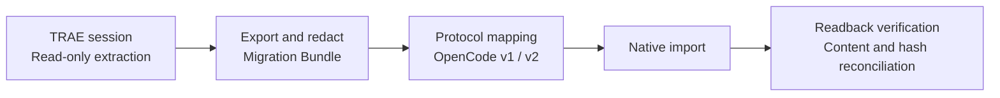

<!-- markdownlint-disable MD013 MD033 MD041 -->

<p align="center">
  <a href="https://trae2opencode.yororoice.top/">
    
  </a>
</p>

<h1 align="center">Trae2OpenCode</h1>

<p align="center">
  <a href="./README.md">简体中文</a>
  ·
  <strong>English</strong>
  ·
  <a href="./README.ja.md">日本語</a>
  ·
  <a href="./README.de.md">Deutsch</a>
  ·
  <a href="./README.ru.md">Русский</a>
  ·
  <a href="./README.zh-Hant.md">繁體中文</a>
</p>

<p align="center">
  <strong>Bring your TRAE sessions to OpenCode, intact.</strong>
  <br>
  Export, redact, map, and import automatically, then verify every item by reading it back.
</p>

<p align="center">
  <a href="https://github.com/yororoA/Trae2OpenCode/actions/workflows/quality.yml"></a>
  <a href="https://github.com/yororoA/Trae2OpenCode/releases"></a>
  = 18.18">
  
  <a href="./LICENSE"></a>
</p>

<p align="center">
  <a href="https://trae2opencode.yororoice.top/">Website</a>
  ·
  <a href="#quick-start">Quick start</a>
  ·
  <a href="./docs/operation-manual.md">Operation manual</a>
  ·
  <a href="./docs/opencode-compatibility.md">Compatibility</a>
  ·
  <a href="./docs/troubleshooting.md">Troubleshooting</a>
  ·
  <a href="./CHANGELOG.md">Changelog</a>
</p>

<!-- markdownlint-enable MD033 MD041 -->

---

> [!IMPORTANT]
> Before your first migration, follow the [operation manual](docs/operation-manual.md).
> On macOS, TRAE must be launched from a terminal with the debugging flags shown below,
> or the tool cannot read complete message bodies.

## One Command, Verifiable Migration

Open the TRAE project window that contains the sessions you want, then run this command
from the repository root:

```sh
npm run migrate:local
```

Select a window and one or more sessions by number. You never need to enter a workbench ID
or session ID manually, and interrupted runs can resume safely from their migration records.

| Interactive selection | Safe handling | Dual-protocol support | Post-write verification |
| :---: | :---: | :---: | :---: |
| Discovers project windows and sessions | Credential redaction and overwrite protection | Detects OpenCode v1 / v2 automatically | Reconciles messages, reasoning, tools, and hashes |



## Compatibility

| Component | Requirement |
| --- | --- |
| TRAE source | TRAE CN **3.3.104**, signed in and started on local CDP port `9222` |
| OpenCode v2 target | Verified baselines: **2.0.0** (legacy), **2.0.12**, **2.0.16**; other stable 2.x releases are checked automatically |
| OpenCode v1 target | Verified baselines: **1.16.0 / 1.17.0** (legacy), **1.17.9 / 1.18.32**; other stable 1.x releases are checked automatically |
| Operating system | macOS and Windows can read local TRAE data; Linux can only import an exported bundle |
| Node.js | `>=18.18`; Node.js 22 is recommended |

Attachments, Skills, and MCP resources are currently out of scope. Unknown TRAE source
versions are rejected. OpenCode support is decided by the detected protocol profile and an
isolated round-trip test rather than by the version number alone.

> [!NOTE]
> For an unlisted stable OpenCode release, the CLI and target service must use the same
> version. Required routes and schemas must match exactly or contain only safe additions.
> Import, export, readback, conflict, and deletion protection are verified in an isolated
> temporary database before migration is allowed.

<!-- Separate adjacent GitHub alerts for Markdown renderers. -->

> [!WARNING]
> Prereleases, unknown major versions, breaking schema changes, and failed behavioral checks
> are rejected. `opencode-ai@1.15.x` cannot preserve ownership metadata, and the `1.14.x`
> OpenAPI does not expose the complete session schema, so these releases are also rejected.
> The tool never writes directly to a legacy database.

## Quick Start

### 1. Clone and install

The package is not published to npm yet:

```sh
git clone https://github.com/yororoA/Trae2OpenCode.git
cd Trae2OpenCode
npm ci
```

Verify the local environment:

```sh
node --version
npm run check
```

### 2. Install a supported OpenCode release

For OpenCode v2:

```sh
npm install -g @opencode/cli@2.0.16
opencode --version
```

For OpenCode v1:

```sh
npm install -g opencode-ai@1.18.32
opencode --version
```

The tool automatically selects current or legacy profiles for supported releases. You can
also run `npm run verify:opencode` to check a local installation independently. It supports
`--binary`, `--output`, and `--json`; see the
[compatibility guide](docs/opencode-compatibility.md#独立验证本机-opencode).

`migrate:local` discovers the active OpenCode service and its dynamic port. If no suitable
service is available, it starts a temporary process on local port `4097`, reuses the current
local session store, and stops only that process when migration finishes.

On Windows, npm creates `.cmd` and `.ps1` shims. The tool resolves the native
`opencode.exe` automatically. If resolution fails, use `T2O_OPENCODE_BINARY` or `--binary`.

### 3. Start TRAE in debug mode

Save your work and quit TRAE completely. On macOS, launch it from a terminal:

```sh
"/Applications/Trae CN.app/Contents/MacOS/Electron" \
  --remote-debugging-address=127.0.0.1 \
  --remote-debugging-port=9222
```

Do not use `open -a ... --args`; current TRAE releases may ignore the debugging flags.

On Windows PowerShell:

```powershell
& "$env:LOCALAPPDATA\Programs\Trae CN\Trae CN.exe" `
  --remote-debugging-address=127.0.0.1 `
  --remote-debugging-port=9222
```

If TRAE is installed elsewhere, update the executable path. Sign in, open the target project,
and make sure its sessions appear in the history panel.

### 4. Run the migration

```sh
npm run migrate:local
```

You can preselect the overwrite policy:

```sh
npm run migrate:local -y  # Confirm OVERWRITE automatically
npm run migrate:local -n  # Skip sessions that require OVERWRITE
```

These flags only control replacement. Workbenches and sessions are still selected from an
interactive list. Without a flag, the program asks you to type `OVERWRITE`.

For each selected session, the tool:

1. Creates an independent bundle and manifest.
2. Redacts recognized credentials from text, titles, and tool payloads.
3. Checks migration completeness and OpenCode compatibility before writing.
4. Imports into OpenCode and reads back messages, reasoning, tool records, and hashes.
5. Keeps the latest verified migration record and removes only superseded terminal records.

If the target already contains the same source session, the tool requires a trusted manifest
from a previous successful run. Before replacement, it verifies that the old target was not
modified. Foreign sessions, edited sessions, and targets without trusted ownership evidence
are never deleted.

### 5. Verify the result

Open the corresponding project in OpenCode and check the session title, message count, and
latest turn. The source TRAE history remains read-only and is never deleted.

For detailed recovery, resume, and rollback procedures, see the
[operation manual](docs/operation-manual.md).

## Important Limitations

- The TRAE workbench for the target session must remain open. Minimized or background windows
  are supported, but closed project windows cannot provide complete message bodies.
- A bundle can be at most `1 GiB`; per-session runtime or transfer data can be at most
  `384 MiB`.
- Safely locatable credentials are replaced with `[REDACTED_SECRET]` and the session is marked
  `partial`. Migration stops if a credential appears in an ID, path, or another field that
  cannot be rewritten safely.
- Persisted assistant progress becomes native OpenCode reasoning. Final responses remain
  normal text, and private `reasoning_content` remains a separate reasoning part.
- TRAE `exec_command` calls become native, expandable OpenCode shell tools with persisted
  output. Original tool fields remain in metadata.
- Large v2 histories may receive a small number of native compaction checkpoints. OpenCode v1
  has no carry-summary compaction messages, so large v1 histories are imported unchanged.
- Missing tool output or final assistant text is never invented. Missing data is marked
  explicitly, and internal tool JSON is not shown as chat text.

## Migration Data and Privacy

Each successful migration creates:

| Directory | Purpose | Contains session text |
| --- | --- | --- |
| `trae-export/` | Latest bundle for remapping and resume | Yes |
| `migration-run/` | Manifest, readback evidence, and migration state | No |

> [!CAUTION]
> These directories contain private local migration data. They are ignored by `.gitignore`;
> do not commit, share, or upload them.

Only obsolete terminal records that were replaced by the current verified version are removed
automatically. Failed, active, or uncertain records are retained for resume and diagnostics.

## Common Issues

| Message | Action |
| --- | --- |
| `无法发现 TRAE workbench` | Quit TRAE completely and relaunch it with the terminal command above; keep the target project window open. |
| `所选 workbench 没有可迁移的本地会话` | Select the correct project window and open that project in TRAE. |
| `无法自动启动 OpenCode` | Confirm that `opencode --version` works, then run `npm run verify:opencode`. |
| `OpenCode 版本或协议不受支持` | Use a stable 1.x or 2.x release whose protocol profile and safety checks pass. |
| `未收录的 OpenCode 版本需要同版本 CLI` | Install the same CLI version as the target service, or set `T2O_OPENCODE_BINARY`. |
| `所选会话包含当前无法无损映射的内容` | Nothing was written to OpenCode. Keep the artifacts and review the [troubleshooting guide](docs/troubleshooting.md). |

## Documentation

The detailed project documentation is currently written in Simplified Chinese.

| Topic | Document |
| --- | --- |
| Getting started | [Operation manual](docs/operation-manual.md) |
| Compatibility | [OpenCode compatibility](docs/opencode-compatibility.md) · [Versioning](docs/versioning.md) · [Changelog](CHANGELOG.md) |
| Troubleshooting | [Errors and common issues](docs/troubleshooting.md) · [Development troubleshooting](docs/development-troubleshooting.md) |
| Migration internals | [Offline CLI, dry-run, import, and readback](docs/m5-1-readonly-cli.md) · [Manifest and resume](docs/m5-3-manifest-resume.md) |
| Safety and recovery | [Credential handling](docs/m5-6-sensitive-content.md) · [Rollback](docs/m5-5-rollback.md) |
| Design and acceptance | [Implementation plan](docs/implementation-plan.md) · [Live runtime report](docs/m5-7-live-runtime-e2e.md) |

## License

Copyright © 2026 yororoA. Distributed under the [ISC License](LICENSE).
