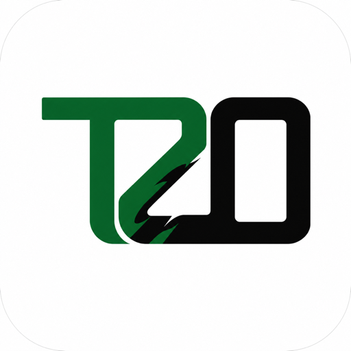

<!-- markdownlint-disable MD013 MD033 MD041 -->

<p align="center">
  <a href="https://trae2opencode.yororoice.top/">
    
  </a>
</p>

<h1 align="center">Trae2OpenCode</h1>

<p align="center">
  <a href="./README.md">简体中文</a>
  ·
  <a href="./README.en.md">English</a>
  ·
  <strong>日本語</strong>
  ·
  <a href="./README.de.md">Deutsch</a>
  ·
  <a href="./README.ru.md">Русский</a>
  ·
  <a href="./README.zh-Hant.md">繁體中文</a>
</p>

<p align="center">
  <strong>TRAE のセッションを、そのまま OpenCode へ。</strong>
  <br>
  エクスポート、機密情報の除去、マッピング、インポートを自動化し、書き込み後に全項目を再検証します。
</p>

<p align="center">
  <a href="https://github.com/yororoA/Trae2OpenCode/actions/workflows/quality.yml"></a>
  <a href="https://github.com/yororoA/Trae2OpenCode/releases"></a>
  = 18.18">
  
  <a href="./LICENSE"></a>
</p>

<p align="center">
  <a href="https://trae2opencode.yororoice.top/">Web サイト</a>
  ·
  <a href="#クイックスタート">クイックスタート</a>
  ·
  <a href="./docs/operation-manual.md">操作マニュアル</a>
  ·
  <a href="./docs/opencode-compatibility.md">互換性</a>
  ·
  <a href="./docs/troubleshooting.md">トラブルシューティング</a>
  ·
  <a href="./CHANGELOG.md">変更履歴</a>
</p>

<!-- markdownlint-enable MD033 MD041 -->

---

> [!IMPORTANT]
> 初回移行の前に[操作マニュアル](docs/operation-manual.md)を確認してください。
> macOS では、以下のデバッグ引数を付けてターミナルから TRAE を起動する必要があります。
> そうしないと、完全なメッセージ本文を読み取れません。

## 1 コマンドで検証可能な移行

移行対象のセッションがある TRAE プロジェクトウィンドウを開き、リポジトリのルートで実行します。

```sh
npm run migrate:local
```

ウィンドウと 1 つ以上のセッションを番号で選択するだけです。workbench ID や session ID を
手入力する必要はなく、中断した処理も保存済みの移行記録から安全に再開できます。

| 対話式選択 | 安全な処理 | 2 種類のプロトコル | 書き込み後の検証 |
| :---: | :---: | :---: | :---: |
| プロジェクトとセッションを自動検出 | 認証情報の除去と上書き保護 | OpenCode v1 / v2 を自動判定 | メッセージ、推論、ツール記録、Hash を照合 |


## 対応環境

| コンポーネント | 要件 |
| --- | --- |
| TRAE ソース | TRAE CN **3.3.104**。ログイン済みで、ローカル CDP ポート `9222` を指定して起動 |
| OpenCode v2 | 検証済み：**2.0.0**（legacy）、**2.0.12**、**2.0.16**。その他の安定版 2.x は自動検証 |
| OpenCode v1 | 検証済み：**1.16.0 / 1.17.0**（legacy）、**1.17.9 / 1.18.32**。その他の安定版 1.x は自動検証 |
| OS | macOS と Windows はローカル TRAE を直接読み取り可能。Linux はエクスポート済み bundle のインポートのみ |
| Node.js | `>=18.18`。Node.js 22 推奨 |

添付ファイル、Skill、MCP リソースは現在の移行対象外です。未確認の TRAE バージョンは拒否されます。
OpenCode の可否はバージョン番号だけでなく、実際のプロトコルプロファイルと隔離された往復テストで決まります。

> [!NOTE]
> 一覧にない安定版 OpenCode では、CLI と対象サービスが同じバージョンである必要があります。
> 必須ルートと schema が完全一致するか、安全な追加のみであることを確認し、独立した一時データベースで
> インポート、エクスポート、再読み取り、競合、削除保護を検証してから移行を許可します。

<!-- Separate adjacent GitHub alerts for Markdown renderers. -->

> [!WARNING]
> プレリリース、未知のメジャーバージョン、破壊的な schema 変更、動作検証の失敗は拒否されます。
> `opencode-ai@1.15.x` は所有権 metadata を保持できず、`1.14.x` の OpenAPI は完全な
> セッション schema を公開しないため、これらも対象外です。旧版データベースへ直接書き込むことはありません。

## クイックスタート

### 1. クローンと依存関係のインストール

このパッケージはまだ npm に公開されていません。

```sh
git clone https://github.com/yororoA/Trae2OpenCode.git
cd Trae2OpenCode
npm ci
```

ローカル環境を確認します。

```sh
node --version
npm run check
```

### 2. 対応する OpenCode をインストール

OpenCode v2：

```sh
npm install -g @opencode/cli@2.0.16
opencode --version
```

OpenCode v1：

```sh
npm install -g opencode-ai@1.18.32
opencode --version
```

対応バージョンでは current または legacy プロファイルが自動選択されます。
`npm run verify:opencode` を使えば、ローカル環境だけを事前検証できます。
`--binary`、`--output`、`--json` に対応しています。詳細は
[互換性ガイド](docs/opencode-compatibility.md#独立验证本机-opencode)を参照してください。

`migrate:local` は起動中の OpenCode サービスと動的ポートを検出します。利用可能なサービスがない場合は、
ローカルポート `4097` で一時プロセスを起動し、現在のローカルセッションストアを使用します。
移行終了時に停止するのは、この一時プロセスだけです。

Windows では npm が `.cmd` / `.ps1` shim を作成します。ツールはネイティブの
`opencode.exe` を自動解決します。失敗した場合は `T2O_OPENCODE_BINARY` または `--binary` を指定してください。

### 3. TRAE をデバッグモードで起動

作業を保存して TRAE を完全に終了し、macOS ではターミナルから起動します。

```sh
"/Applications/Trae CN.app/Contents/MacOS/Electron" \
  --remote-debugging-address=127.0.0.1 \
  --remote-debugging-port=9222
```

`open -a ... --args` は使用しないでください。現在の TRAE ではデバッグ引数が無視される場合があります。

Windows PowerShell：

```powershell
& "$env:LOCALAPPDATA\Programs\Trae CN\Trae CN.exe" `
  --remote-debugging-address=127.0.0.1 `
  --remote-debugging-port=9222
```

別の場所にインストールしている場合は実行ファイルのパスを変更してください。TRAE にログインし、
対象プロジェクトを開いて、履歴パネルにセッションが表示されることを確認します。

### 4. 移行を実行

```sh
npm run migrate:local
```

上書き方針を事前に指定できます。

```sh
npm run migrate:local -y  # OVERWRITE を自動承認
npm run migrate:local -n  # OVERWRITE が必要なセッションをスキップ
```

これらの引数は置換方針だけを制御します。workbench とセッションは引き続き一覧から選択します。
引数を付けない場合は `OVERWRITE` の入力を求められます。

選択したセッションごとに、ツールは次を実行します。

1. 独立した bundle と manifest を作成します。
2. 本文、タイトル、ツール payload から認識済みの認証情報を除去します。
3. 書き込み前に移行の完全性と OpenCode の互換性を確認します。
4. OpenCode へインポートし、メッセージ、推論、ツール記録、Hash を再読み取りします。
5. 最新の検証済み記録を保持し、置換済みの古い完了記録だけを削除します。

対象に同じソースセッションがある場合は、以前の成功した移行で作成された信頼できる manifest が必要です。
置換前に既存セッションが変更されていないことを確認します。外部セッション、編集済みセッション、
所有権を証明できない対象は削除されません。

### 5. 結果を確認

OpenCode で該当プロジェクトを開き、セッションタイトル、メッセージ数、最新ターンを確認します。
元の TRAE 履歴は読み取り専用のままで、削除されません。

再開やロールバックを含む詳細な手順は[操作マニュアル](docs/operation-manual.md)を参照してください。

## 重要な制限

- 対象セッションの TRAE workbench を開いたままにする必要があります。バックグラウンドや最小化は可能ですが、
  閉じたプロジェクトウィンドウから完全な本文を取得することはできません。
- bundle の上限は `1 GiB`、1 セッションの runtime / transfer データの上限は `384 MiB` です。
- 安全に特定できる認証情報は `[REDACTED_SECRET]` に置換され、セッションは `partial` になります。
  ID、パスなど安全に変更できないフィールドに認証情報がある場合、移行は停止します。
- 保存済みの assistant 進捗は OpenCode のネイティブ reasoning になります。最終回答は通常の本文として保持されます。
- TRAE の `exec_command` は OpenCode の展開可能なネイティブ shell ツールへ変換され、保存済み出力も保持されます。
- 大きな v2 履歴には少数のネイティブ compaction checkpoint が追加される場合があります。
  OpenCode v1 には carry-summary がないため、大きな履歴はそのままインポートされます。
- 保存されていないツール出力や最終回答を推測して補うことはありません。欠落は明示的に記録されます。

## 移行データとプライバシー

成功した移行では次のディレクトリが作成されます。

| ディレクトリ | 用途 | セッション本文 |
| --- | --- | --- |
| `trae-export/` | 再マッピングと再開に使う最新 bundle | 含む |
| `migration-run/` | manifest、再読み取り証拠、移行状態 | 含まない |

> [!CAUTION]
> これらはローカルの非公開データです。`.gitignore` の対象ですが、コミット、共有、アップロードしないでください。

現在の検証済みバージョンで置換された古い完了記録だけが自動削除されます。失敗中、実行中、
または安全性を確認できない記録は、再開や調査のため保持されます。

## よくある問題

| 表示されるメッセージ | 対処 |
| --- | --- |
| `无法发现 TRAE workbench` | TRAE を完全に終了し、上記のターミナルコマンドで再起動して対象プロジェクトを開きます。 |
| `所选 workbench 没有可迁移的本地会话` | 正しいプロジェクトウィンドウを選び、そのプロジェクトを TRAE で開きます。 |
| `无法自动启动 OpenCode` | `opencode --version` を確認し、`npm run verify:opencode` を実行します。 |
| `OpenCode 版本或协议不受支持` | 安全性検証を通過する安定版 1.x または 2.x を使用します。 |
| `未收录的 OpenCode 版本需要同版本 CLI` | 対象サービスと同じバージョンの CLI をインストールするか、`T2O_OPENCODE_BINARY` を指定します。 |
| `所选会话包含当前无法无损映射的内容` | OpenCode への書き込みは行われていません。生成物を保持して[トラブルシューティング](docs/troubleshooting.md)を確認します。 |

## ドキュメント

詳細ドキュメントは現在、簡体字中国語で提供されています。

| トピック | ドキュメント |
| --- | --- |
| はじめに | [操作マニュアル](docs/operation-manual.md) |
| 互換性 | [OpenCode 互換性](docs/opencode-compatibility.md) · [バージョン管理](docs/versioning.md) · [変更履歴](CHANGELOG.md) |
| 問題解決 | [エラーと一般的な問題](docs/troubleshooting.md) · [開発環境の問題](docs/development-troubleshooting.md) |
| 移行の仕組み | [オフライン CLI、dry-run、インポート、再読み取り](docs/m5-1-readonly-cli.md) · [manifest と再開](docs/m5-3-manifest-resume.md) |
| 安全と復旧 | [認証情報の処理](docs/m5-6-sensitive-content.md) · [ロールバック](docs/m5-5-rollback.md) |
| 設計と検証 | [実装計画](docs/implementation-plan.md) · [実環境レポート](docs/m5-7-live-runtime-e2e.md) |

## ライセンス

Copyright © 2026 yororoA. [ISC License](LICENSE) の下で提供されます。
